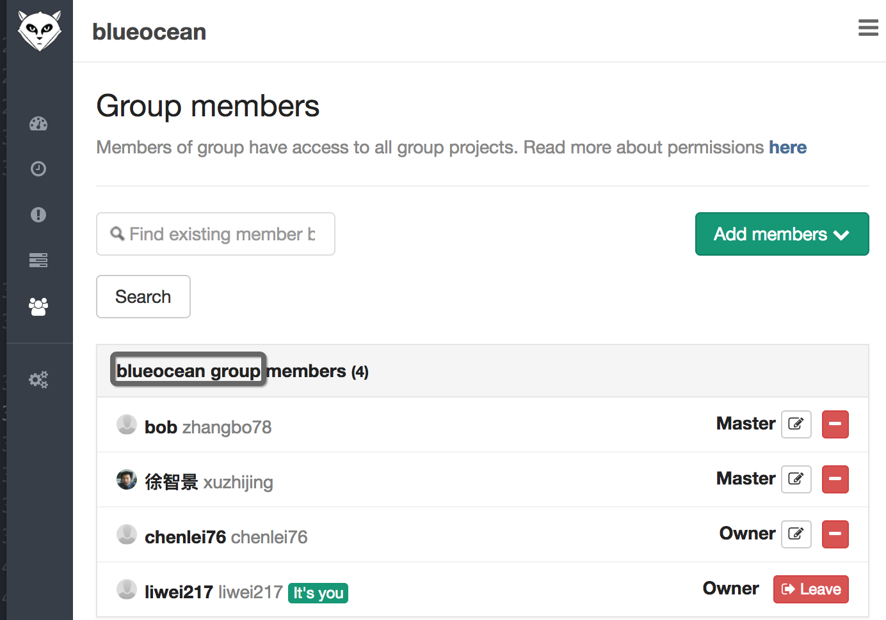
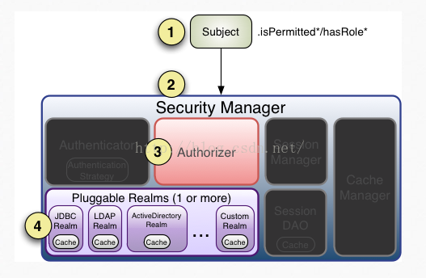

# QuickStart

## 简介


``shiro``提供4个基础功能：

- **Authentication**： 认证（俗称“登陆”）。指的是“谁是谁”的问题。
- **Authorization**： 授权（俗称“访问控制”）。指的是“谁有权限访问什么东西”的问题。

``shiro`` 提供基于角色的授权模型。里面有些术语：

- 资源（``Resource``）：以操作系统的文件系统为例。资源可以是文件或目录。
- 权限（``Permission``）：一般理解为“对资源的操作”。比如文件的读权限，写权限，执行权限等。当然权限的粒度，设计者完全可以自己定义，我们也可以把读、写和执行笼统化成为一个权限，相当于权限粒度只到文件整体，不区分文件的具体操作。
- 角色（``Role``）：“授权”回答的是“谁有权限访问什么资源”，也就是我们需要建立用户与资源/资源操作的映射关系。比如：(User1, File1, READ)；(User1, File2, WRITE), (User2, File2, WRITE)。这种直接映射的好处是可以控制的粒度很细，不好的是太琐碎了，实际上我们看操作系统，往往给用户区分“访客身份”或者“管理员”身份等，管理员身份能有很高的权限，访客身份则很少。也就是，通常人们会对各种各样的权限，依据安全级别的不同，打个整体包（分类），然后赋予某种角色（比如普通员工，高级经理，VP等）。**角色** 就是这种打包机制，它是权限的集合。这样做的目的就是为了“简化”，也为了“性能”。 **基于角色的访问控制** 是一个专门的术语（``RBAC``: ``Role Based Access Control``），现已被广泛应用，比如``gitlab``中也都是这个模型。
- 主体（``Subject``）：前面我们说“授权是指谁有权限访问什么东西”，这里的“东西”就是前面的“资源”，“谁”就是“主体”，俗称“用户”。它是个哲学领域的词汇，主体与客体（资源可以叫做客体）。


我们来看看原文：

>In the context of ``Authorization``, ``Roles`` are effectively **a collection of permissions** used to **simplify** the management of permissions and users. So users can be assigned roles **instead of being assigned permissions directly**, which can get complicated with larger user bases and more complex applications. So, for example, a bank application might have an administrator role or a bank teller role.

### gitlab RBAC


gitlab 给用户区分了5种角色：Guest, Reporter, Developer, Master 和 Owner。每种角色都赋予了一定访问的action集。

顺便提一下，这里没有严格的资源与资源的操作的概念。这个类似``RESTful API``，尽可能做到面向资源+资源的标准操作，不好抽象时，也只能面向功能（``action``）。


### User Group

前面讲到，为了简化，可以把权限做个分类，把权限的集合定义为角色。然后给每个人赋予一定的角色。但是，加入一个公司有数万员工，则需要挨个给每个员工赋予角色，也是很大的工作量。但是员工是隶属于部门的或者产品线的，我们能不能把员工也做个分类，把员工的集合定义为``Group``，然后给``Group``赋予角色。这样，当一个员工加入某个``Group``时（比如某个项目组或某个部门），他就继承了``Group``成员所具备的权限（需要提前配置``Group``与``Role``的对应关系）。

还是以``gitlab``为例，我们可以创建``Project``和``Group``。其中``Group``就是项目组或说事业部。比如``蓝海``项目组，里面可以有很多``Project``，也可以有很多项目组成员。



当然这里的角色，跟项目角色没有直接的关系，只是名字相同，它这里是组的角色。组的角色对应的权限只跟组有关。换句话说，gitlab中，用户加入某个组，不会演变出项目里的权限，它只是组权限。**gitlab 并没有把 Group 赋予 Role** 。


>``permissions`` can be grouped in a ``Role`` and that Role could be associated with one or more ``User objects``. Or some applications can have **a Group of users** and **a Group can be assigned a Role**, which by ``transitive association`` (可传递的关联关系) would mean that all the Users in that Group are **implicitly** granted the permissions in the Role.

>There are many variations for **how permissions could be granted to users** .


## 形式化语法

为了表征``认证``与``授权``，``shiro``定义了一套形式化语法。它用``shiro.ini``配置文件来描述，当然也可以用关系型数据库描述（这个由``shiro``的``Plugin Realm``机制支持），我们先看看``shiro.ini``的形式化：

``` ini
[users]
;userName=password,role1,role2
root = yYMWOIx3, admin
guest = 123456, guest
zhangsan = zs1234, vip

[roles]
;roleName=domain:action:instance,domain:action:instance
admin = *
guest = videos:download:demo
vip = videos:download,upload,delete
```

它定义了两个``section``块：一个是``users``，用来定义登陆用户；另一个是``roles``，用来定义角色与权限。

语法：

```
userName=password,role1,role2
roleName=domain:action:instance,domain:action:instance
```

两行语法体现的语义：
- 给用户赋角色，它们是多对多的关系，所以每个用户可以有多个角色，一个角色也能被赋于多个用户；
- 给角色赋权限，也是多对多。权限又有自己的形式化语法，分三级：``domain:action:instance``。如果非要用面向对象的概念类比，那就是``class:method:instance``。可以看出``shiro``除了精确到资源+资源的操作外，还对资源可以进一步精确到某个实例。

上例，配置了3个用户：

```
root = yYMWOIx3, admin
guest = 123456, guest
zhangsan = zs1234, vip
```

其中：

```
admin = *  ; 管理员角色具备一切权限
guest = videos:download:demo  ; 游客角色仅仅可以访问名叫demo的视频，而且只能下载播放
vip = videos:download,upload,delete   ; vip付费用户则可以访问所有视频，而且可以上传和删除
```

看下官方原文：
>In this scenario you use three parts - the first is the ``domain``, the second is the ``action(s)``, and the third is the ``instance``(s) being acted upon.

>So for example you could have
>
``` ini
printer:query:lp7200
printer:print:epsoncolor
```

>The first defines the behavior to ``query`` the ``printer`` with the ID ``lp7200``. The second permission defines the behavior to ``print`` to the ``printer`` with ID ``epsoncolor``. If you grant these permissions to users, then they can perform specific behavior on specific instances. Then you can do a check in code:
>
``` java
if ( SecurityUtils.getSubject().isPermitted("printer:query:lp7200") {
    // Return the current jobs on printer lp7200
}
```


### 常见练习

- 单个资源单个权限

``` java
subject.checkPermissions("update");
```

- 单个资源多个权限

``` ini
配置：user:update，user:delete 【等价于user:update,delete】
```

``` java
用法：subject.checkPermissions("user:update","user:delete");
等价于：subject.checkPermissions("user:update,delete");
```

- 单个资源所有权限

``` ini
配置：user:query，user:add，user:update，user:delete【等价于user:*】
```

``` java
用法：subject.checkPermissions("user:query","user:add","user:update","user:delete");
等价于：subject.checkPermissions("user:*");
```

- 所有资源单个权限

``` ini
配置：*:view
```

``` java
用法：subject.checkPermissions("user:view");
```

### 精细到实例

- 单个实例单个权限

``` ini
配置：user:update:tom
```

表示只允许对用户名叫tom的用户执行update操作。

```
用法：subject.checkPermissions("user:update:tom");
```

- 单个实例多个权限

``` ini
配置：user:update,delete:tom
```

表示只允许对名叫tom的用户进行update或delete操作。

``` java
用法：subject.checkPermissions("user:update,delete:tom");
等价于：subject.checkPermissions("user:update:tom"，"user:deletee:tom");
```

- 单个实例所有权限

``` ini
配置：user:*:tom
```

表示允许对名叫tom的用户进行所有操作

``` java
用法：subject.checkPermissions("user:query:tom"，"user:add:tom"，"user:update:tom"，"user:deletee:tom");
```

- 所有实例单个权限

``` ini
配置：user:query:*
```

表示对所有用户进行查询操作。

``` java
用法：subject.checkPermissions("user:query:tom", "user:query:jack");
```

- 所有实例所有权限

``` ini
配置：user:*:*
```

表示所有用户的所有操作。

``` java
用法：subject.checkPermissions("user:add:tom", "user:delete:jack");
```

### 前缀匹配算法

>如 “user:view” 等价于 “user:view:*”；而“organization”等价于“organization:*”或者“organization:*:*”。

这种匹配方式其实就是“前缀匹配”，在URL里面很常见。


```
另外如 “user:*” 可以匹配如 “user:delete”、“user:delete”可以匹配如“user:delete:1”、“user:*:1”可以匹配如“user:view:1”、“user”可以匹配“user:view”或“user:view:1”等。即*可以匹配所有，不加*可以进行前缀匹配；但是如“*:view”不能匹配
“system:user:view”，需要使用“*:*:view”，即后缀匹配必须指定前缀（多个冒号就需要多个 * 来匹配）。
```


## 数据库存储

上面的形式化结构，也可以用关系型来存储：
>>根据Shiro的设计思路，用户与角色之前的关系为多对多，角色与权限之间的关系也是多对多。在数据库中需要因此建立5张表，分别是用户表（存储用户名，密码，盐等）、角色表（角色名称，相关描述等）、权限表（权限名称，相关描述等）、用户-角色对应中间表（以用户ID和角色ID作为联合主键）、角色-权限对应中间表（以角色ID和权限ID作为联合主键）。

## 验证流程

当我们配置完成权限后，接着就是需要“验证”：



第一步：当前的subject调用isPermitted*/hasRole*接口，然后委托给 ``SecurityManager``，而SecurityManager接着会委托给Authorizer。
第二步：Authorizer是真正的授权者，如果我们调用上面的接口，其首先通过PermissionResolver把字符串转换成相应的Permission实例。
第三步：在进行授权之前，会调用相应的Realm获取subject相应的角色/权限用于匹配传入的角色/权限
第四步：Authorizer会判断Realm的角色/权限是否和传入的匹配，如果有多个Realm，会委托给ModularRealmAuthorizer进行循环判断，如果匹配到示例的isPermitted*/hasRole*，则结果为true，否则为false


从图可以看出几点：

- Subject: 程序员编码时，只需要跟``Subject``打交道。通过``Subject``来判断是否有权限。
- SecurityManager: 核心类。
- Pluggable Realms: 配置独立性。同样的``RBAC``，既可以用``ini``文件描述，也可以用``JDBC``描述。也可以支持``
LDAP``。


## 两种判断角度

有两种判断角度：一个是``Role Checks``，另一个是``Permission checks``。
>``Role checks`` in code are generally a reflection of an implicit role.
>``Permission checks`` in code are a reflection of an explicit role.

- Role checks 代码

``` java
subject.hasRole("admin");
```
- Permission checks 代码

``` java
subject.isPermitted("videos:download");
```

据统计，多数人喜欢用第一种方式，在鉴权时，直接问是否具备某种角色。因为它简单，但是不利于维护，因为这相当于直接的硬编码。因为权限是可变的，如果我们要增加一种角色，比如VIP也能访问，那么就要变成 ``subject.hasRole("admin,vip")``。

第二种方式访问某个资源时，就问资源本身，因为资源是不会变的。比如我们在``Spring MVC``框架中，``VideosController``的``download``方法中，鉴权代码 ``subject.isPermitted("videos:download")``即可。如果VIP也能访问，我们只需要修改配置文件，而不用修改代码：

``` ini
[users]
zhangsan = 123456, admin

[roles]
admin=videos:download
```

修改为：

``` ini
[users]
zhangsan = 123456, admin
wangwu = 654321, vip

[roles]
admin=videos:download
vip=videos:download
```

这就是官方文档说的：

>The big benefits of ``explicit roles`` (Permission checking) are easier manageability and lower maintenance of your application. If you ever need to add, remove, or change a role, you can do so without touching your source code. And in Shiro, you’ll also be able to **dynamically** add, remove, or change roles at runtime and your authorization checks will always have up to date values. This means you won’t have to force users to log out and log back in order to get their new permissions.

## HelloWorld 代码

详细代码见 ``hello-world.git``的 ``shiro`` 分支的 ``HelloWorld.java``。

### 配置文件

一个名叫``hello-world.ini``的配置文件，放到classpath下：

``` ini
[users]
zhangsan = zs1234, vip

[roles]
vip=videos:download,videos:upload,printer:print,query
```

上述语义是：定义了一个``zhangsan``的用户，它的密码是``zs1234``，它的角色是vip；给vip角色赋予的权限是：视频下载；视频上传；打印机打印和打印机查询。其中``printer:print,query``表达形式，在官方文档叫 [multiple-values](http://shiro.apache.org/permissions.html#multiple-values)。它说的是``printer:print,query``表达式完全等效于``printer:print``和``printer:query``。

### maven依赖

``` xml
<dependency>
			<groupId>org.apache.shiro</groupId>
			<artifactId>shiro-core</artifactId>
			<version>1.3.2</version>
</dependency>
```

注意：完整需要依赖``slf4j``日志。

### 入门代码

``` java
import org.apache.shiro.SecurityUtils;
import org.apache.shiro.authc.UsernamePasswordToken;
import org.apache.shiro.config.IniSecurityManagerFactory;
import org.apache.shiro.mgt.SecurityManager;
import org.apache.shiro.subject.Subject;
import org.apache.shiro.util.Factory;

public class HelloWorld {

	public static void main(String[] args) throws Exception {

		// load configuration and create SecurityManager
		Factory<SecurityManager> securityManagerFactory = new IniSecurityManagerFactory("classpath:hello-world.ini");
		SecurityManager securityManager = securityManagerFactory.getInstance();
		SecurityUtils.setSecurityManager(securityManager);

		Subject subject = SecurityUtils.getSubject();

		// login as vip Role

		subject.login(new UsernamePasswordToken("zhangsan", "zs1234") );

		// Role checking

		if (subject.hasRole("vip")) {
			System.out.println("has role vip");
		} else {
			System.out.println("no role vip");
		}

		// Permission checking

		System.out.println(String.format("%s access %s: %s", subject.getPrincipal(), "videos:upload",
				subject.isPermitted("videos:upload")));

		System.out.println(String.format("%s access %s: %s", subject.getPrincipal(), "videos:download",
				subject.isPermitted("videos:download")));

		System.out.println(String.format("%s access %s: %s", subject.getPrincipal(), "videos:*",
				subject.isPermitted("videos:*")));

		System.out.println(String.format("%s access %s: %s", subject.getPrincipal(), "printer:print",
				subject.isPermitted("printer:print")));
		System.out.println(String.format("%s access %s: %s", subject.getPrincipal(), "printer:query",
				subject.isPermitted("printer:query")));

	}

}

```

代码主要是依据``classpath:hello-world.ini``配置文件，生成对应的``SecurityManager``，然后先登录，再鉴权，鉴权用了两种方式：一种是Role checking，另一种是 Permission checking方式。所有的鉴权操作，内部都会被委派给``SecurityManager``，程序员需要打交道的仅仅是``Subject``类。为了独立任何容器运行（比如Web容器），需要手动诸如``SecurityUtils.setSecurityManager(securityManager);``。

代码运行结果：

``` text
has role vip
zhangsan access videos:upload: true
zhangsan access videos:download: true
zhangsan access videos:*: false
zhangsan access printer:print: true
zhangsan access printer:query: false
```

### 惊现BUG?

运行结果，显示居然没有``printer:query``权限。修改配置：

``` ini
[roles]
vip=videos:download,videos:upload,printer:print,printer:query
```

就有权限了。``printer:print,printer:query`` **不** 等效于 ``printer:print,query``。
尽管官方文档在 [permissions.html multiple-values](http://shiro.apache.org/permissions.html#multiple-values) 章节谈到相等。

但是后来想想语法上其实会有歧义？比如：

``` ini
[roles]
vip=videos:download,upload,printer:print,query
```

一种理解是``multiple-values``，断句是：``videos:download,upload`` 与 ``printer:print,query``。
另一种理解是：``videos:download``，``upload``，``printer:print`` 和 ``query`` 。

的的确确，当我们去验证:

``` java
subject.isPermitted("query");
System.out.println(String.format("%s access %s: %s", subject.getPrincipal(), "query",
				subject.isPermitted("query")));
```

输出的是：``true``。


## 参考资料

- [shiro简介](https://shiro.apache.org/introduction.html)
- [authorization guide](https://shiro.apache.org/java-authorization-guide.html)
- [权限配置（中文版）](http://blog.csdn.net/abcd898989/article/details/50682426)
- [权限配置（官方版）](http://shiro.apache.org/permissions.html)
